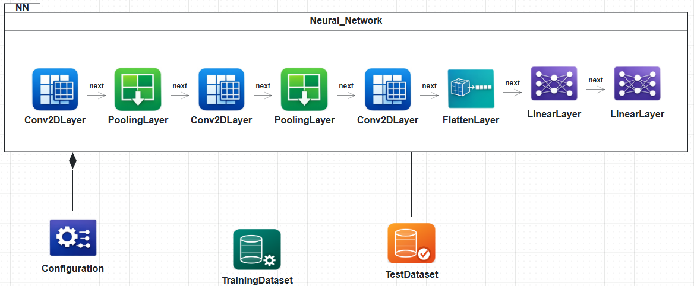
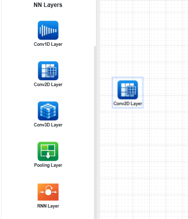
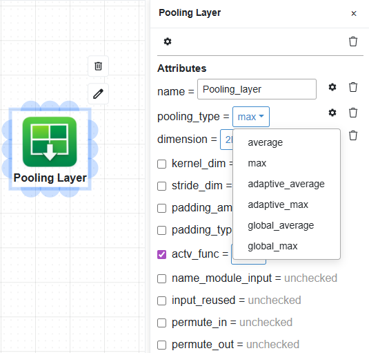
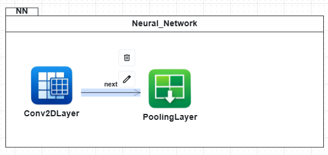
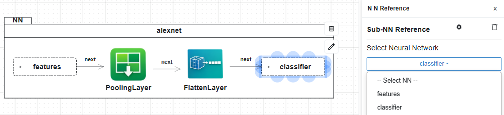
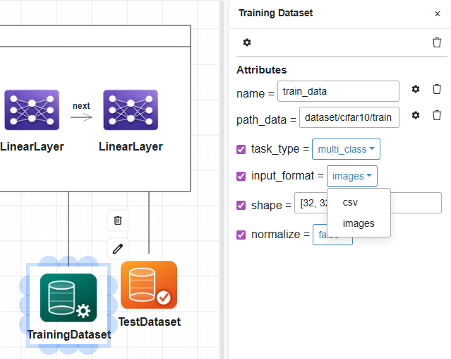
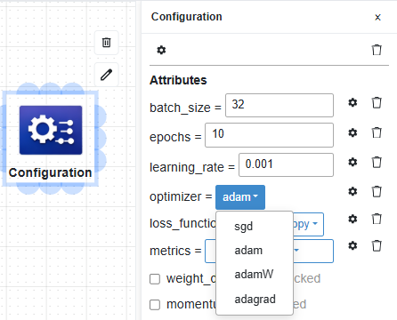
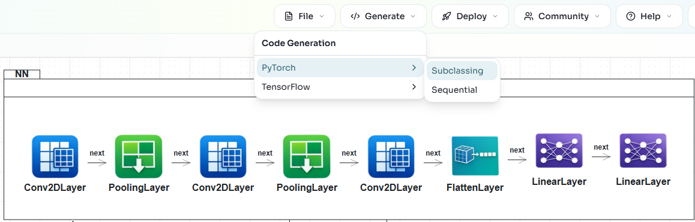

Neural Network Diagrams
=======================

Neural Network (NN) diagrams are used to define
`BESSER neural network models <https://besser.readthedocs.io/en/latest/buml_language/model_types/nn.html>`_,
which the PyTorch and TensorFlow generators consume to produce runnable code.

Overview
--------

A neural network is defined inside an **NNContainer**, where layers and tensor operations
are connected by **NNNext** relationships.

A diagram can hold several NNContainers on the same canvas: one acts as the top-level
network and the others are reusable sub-networks, referenced from the main container via
**NNReference**.

Optional **Configuration** and **Training/Test Dataset** elements provide hyperparameters
and data sources.

NN Container
------------

Drag an **NNContainer** from the palette onto the canvas first. All layers and tensor
operations live inside it. A canvas may contain several NNContainers; one acts as the
top-level network and the others can be referenced as sub-networks (see *NN Reference*
below).

Layers
------

The palette provides the following layer types:

*   **Convolutional**: ``Conv1D``, ``Conv2D``, ``Conv3D``
*   **Pooling**: ``Pooling`` (with ``pooling_type`` selecting max, average, adaptive, or
    global variants)
*   **Recurrent**: ``RNN``, ``LSTM``, ``GRU``
*   **General layers**: ``Linear``, ``Flatten``, ``Embedding``
*   **Layer modifiers**: ``Dropout``, ``LayerNormalization``, ``BatchNormalization``

Drag a layer from the palette into the NNContainer.

Double-click a layer to edit its attributes. Mandatory attributes are always shown;
optional ones are toggled on with checkboxes. Many fields use dropdowns
(``pooling_type``, ``actv_func``, ``padding_type``...) and list-typed attributes such as
``kernel_dim`` or ``stride_dim`` adapt to the layer's dimension (for example
``[3, 3]`` for 2D, ``[3, 3, 3]`` for 3D).

Tensor Operations
-----------------

Tensor operations transform tensors between layers. Drag a **TensorOp** element into the
NNContainer and pick a ``tns_type``:

*   ``reshape``
*   ``concatenate``
*   ``transpose``
*   ``permute``
*   ``multiply``
*   ``matmultiply``

The selected ``tns_type`` controls which dimension attribute is shown on the popup
(``reshape_dim``, ``concatenate_dim``, ``transpose_dim``, ``permute_dim``). Layers and
tensor operations are interchangeable building blocks and can be interleaved freely.

NNNext Relationships
--------------------

Drag from a connection point on a source module to any target module to create an
**NNNext** relationship. The ``"next"`` arrow defines the order of the forward pass,
regardless of whether the connected modules are layers, tensor operations, or a mix of
both.

NN Reference
------------

Use an **NNReference** element to reuse an NN already defined on the same canvas. Select
the target NNContainer from the popup; the referenced network is included as a
sub-network during code generation. This lets you compose a top-level model from smaller,
reusable sub-networks.

Datasets
--------

Optional **Training Dataset** and **Test Dataset** elements declare data sources for the
network. Connect each dataset to the NNContainer with an association line.

Mandatory attributes:

*   ``name``: dataset name.
*   ``path_data``: file or folder path to the dataset.

Optional attributes:

*   ``task_type``: ``binary``, ``multi_class``, or ``regression``.
*   ``input_format``: ``csv`` or ``images``.

When ``input_format = images``, two additional attributes appear:

*   ``shape``: image shape (e.g. ``[32, 32, 3]``).
*   ``normalize``: ``true`` or ``false``.

Configuration
-------------

The optional **Configuration** element holds training hyperparameters. Connect it to the
NNContainer with a composition relationship.

Mandatory attributes: ``batch_size``, ``epochs``, ``learning_rate``, ``optimizer``
(``sgd``, ``adam``, ``adamW``, ``adagrad``), ``loss_function`` (``crossentropy``,
``binary_crossentropy``, ``mse``), and ``metrics`` (multi-select from ``accuracy``,
``precision``, ``recall``, ``f1-score``, ``mae``).

Optional attributes: ``weight_decay``, ``momentum``.

Generating Code
---------------

Run **Quality Check** from the top bar to catch structural issues such as disconnected
layers or missing mandatory attributes. Then open the **Generate** menu and choose a
framework and style:

*   **PyTorch / Subclassing**: ``torch.nn.Module`` subclass with an explicit forward
    pass.
*   **PyTorch / Sequential**: ``nn.Sequential`` composition for strictly sequential
    architectures.
*   **TensorFlow / Subclassing**: ``tf.keras.Model`` subclass with a custom ``call()``.
*   **TensorFlow / Sequential**: ``keras.Sequential`` composition.

The NN architecture definition is generated in the selected framework, along with
training and evaluation code when datasets and Configuration are defined.

